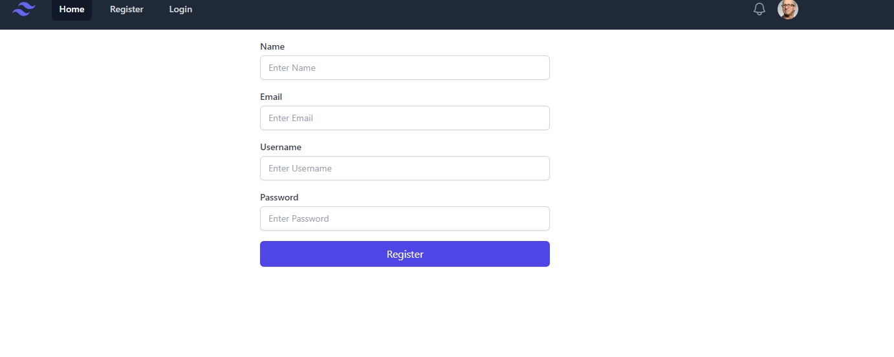
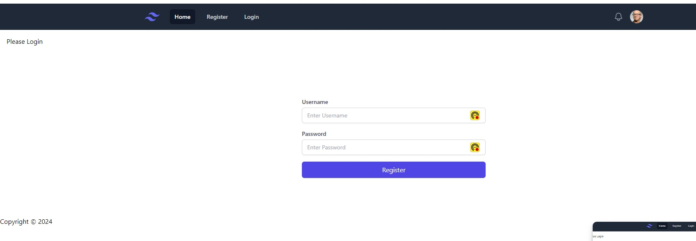
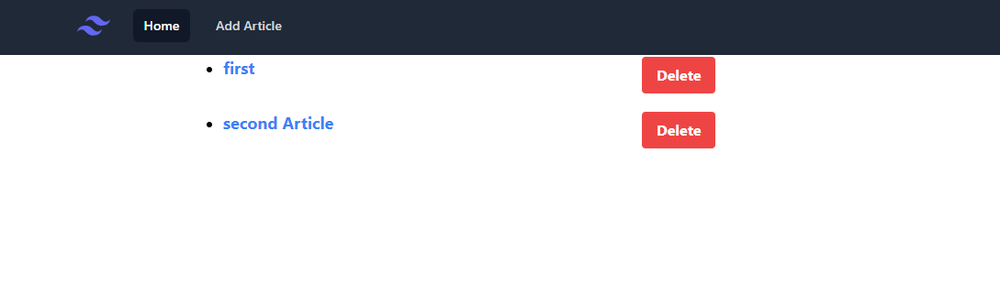
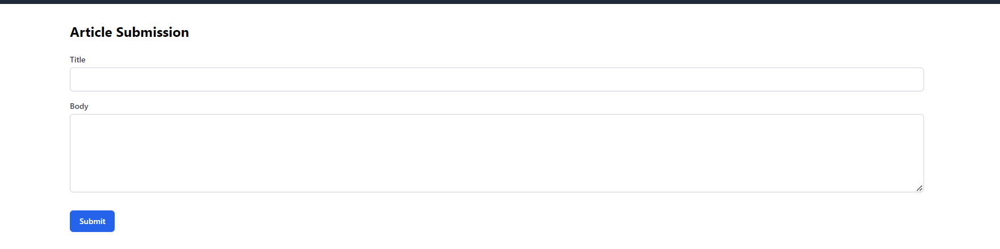

# Node.js, Express, EJS & MongoDB Knwledge - CRUD


## Register

## Login

## home

## add


## Overview

This project is a knowledge-sharing application where users can register, log in, and view articles. Authorized users can perform CRUD (Create, Read, Update, Delete) operations on articles. The application uses **Node.js**, **Express**, **Pug** as the template engine, **Tailwind CSS** for styling, and **MongoDB** for data storage.
## Features

- **User Registration**: New users can sign up and create an account.
- **User Authentication**: Users can log in with their credentials.
- **View Articles**: All users can browse and read articles.
- **CRUD Operations**: Authenticated users can add, edit, update, and delete articles.

## Prerequisites

To run this application, you will need:

- **Node.js**: Ensure you have Node.js installed on your machine. You can download it from [Node.js official website](https://nodejs.org/).
- **MongoDB**: A free MongoDB cluster. Sign up for a free database cluster on [MongoDB Atlas](https://www.mongodb.com/cloud/atlas).

### Option 1: Local MongoDB Setup

1. **Install MongoDB**:
   - Download and install MongoDB from the official [MongoDB website](https://www.mongodb.com/try/download/community).
   - Follow the instructions to set up MongoDB on your local machine.

2. **Start MongoDB**:
   - Run the following command to start the MongoDB service:
     ```bash
     mongod
     ```
   - MongoDB will be running on `mongodb://localhost:27017`.

3. **Create a `.env` file**:
   - Create a file named `.env` in the root of your project directory and add the following line:
     ```plaintext
     MONGODB_URI=mongodb://localhost:27017/knowledgeSharingApp
     JWT_SECRET=YourJWTSecret
   ```
### Option 2: MongoDB Atlas Setup

1. **Sign Up for MongoDB Free Database Cluster**:
   - Visit [MongoDB Atlas](https://www.mongodb.com/cloud/atlas) and create an account.
   - Create a new cluster and follow the instructions to set up your database.

2. **Create a `.env` file**:
   - In the root of your project directory, create a `.env` file and add the following lines, replacing `<username>`, `<password>`, and `clusterName` with your MongoDB Atlas credentials:
     ```plaintext
     MONGODB_URI=mongodb+srv://<username>:<password>@<clusterName>.mongodb.net/knowledgeSharingApp
     JWT_SECRET=YourJWTSecret
     ```

## Installation

1. **Clone the repository to your local machine:**:

- git clone https://github.com/riyazpt/knowledge-sharing-app.git

2. **Navigate to the project directory:**:

- cd knowledge-sharing

3. **Navigate to the project directory:**:

- npm install

## Run App

1. **npm run dev**:


The app will be running at http://localhost:3000.

## Built With

- **Node.js** - Server-side JavaScript runtime
- **Express** - Web framework for Node.js
- **Pug** - Template engine
- **MongoDB** - NoSQL database
- **Tailwind CSS** - Utility-first CSS framework for styling

